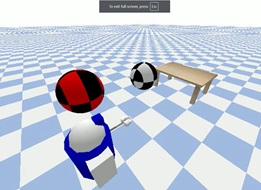

#### 🤖  Manipulation of Objects in Pybullet 3D Simulated Environment for Robotic Applications 🤖

#### Author [@surendervarma](https://www.github.com/surenderdev)


#### Installation

```bash
pip install -r requirements.txt
```
    
#### Demo


```bash
python experiment1.py
```


Moving Object1: Click on the image to play.
<br />
[](https://vimeo.com/1054422380/f5b545434e)

Moving Object2: Click on the image to play.
<br />
[](https://vimeo.com/1054422503/628fc29ca2)


Moving Object2 with Object1 in fixed location: Click on the image to play.
<br />
[](https://vimeo.com/1054422431/b0bcd8bd93)


## Experiment1: Object Detection and Movement

#### 1.	Set up Simulation Environment:

Configure PyBullet and load simulation objects 

#### 2.	Perform Object Detection:

Utilize YOLO to detect and annotate objects (robot, bench, ball) in the simulated environment.

#### 3.	Move Desired Object to Target Position:
Move specified object (ball) to the defined target position (on top of bench).

#### 4.	Capture journey:
Capture the movement from beginning to end as a video file.

----------
### Step 1: Setup YOLO, PyBullet, Objects, and Video Writer
Connect to PyBullet: Connect to PyBullet and set initial conditions.
Initialize the object detection model with predefined classes. 
Configure Video Writer: Set up the video writer to save needed frames in an MP4 file.
Capture and save the initial scene setting as an image.
### Step 2: Object Detection
Defined a function to detect objects using YOLO and annotate the detected objects in the scene. Today, we may deal with a kitchen scenario; tomorrow, it might be an office or sports scenario. Hence YOLO-World is chosen as the base model to ensure flexibility and avoid dependence on specific training data and models each time.
### Step 3: Move Object
Defined a function to move a specified object (ball) to a target position (top of bench), capturing frames along the way.
### Stability while moving:
I have noticed even a small movement in the scene is making entire scene unstable with all objects (ball, robot and bench) flying away; taking off away from the scene. To prevent this from happening, many steps were taken. 
The ball's movement is broken into four distinct phases: lifting vertically, moving horizontally, lowering to the target, and allowing moved object to settle. This step-by-step approach ensured smooth and controlled movements.
 ##### Phase 1: Lift Vertically: The ball is lifted vertically to avoid collisions. 
 ##### Phase 2: Move Horizontally: The ball is moved horizontally while maintaining a consistent height to avoid unintentional contact with other objects.
 ##### Phase 3: Lower to Target: The ball is lowered to the target position gently to prevent it from bouncing upon reaching the target height.
 ##### Phase 4: Allow Settling: Additional simulation steps are run to allow the ball to settle and ensure there is stability in the final position of object placement.

```bash
python experiment2.py
```

## Experiment2: Robot Arm Detailing 

#### Simulation of KUKA iiwa Robot Arm in PyBullet
This experiment involves simulating the movements of a KUKA iiwa robot arm using the PyBullet physics engine. The goal is to explore and document the robot's range of motion by moving its joints individually and in various combinations. Output images and animated GIFs are created to visually represent these movements, providing insights into the robot's locomotice capabilities and joint limits.

#### Experiments Conducted
#### Single Link Movement: 
Each joint is moved individually across its entire range, with images captured at each position and compiled into GIFs.

#### Multi-Link Movements: 
Groups (2,3, 4 etc) of joints are moved simultaneously, capturing their combined movements in images and GIFs.

#### This approach provides a thorough visual documentation of the robot's joint movements, helping to understand its mechanical capabilities and limitations.


## Acknowledgements

 - [Ultralytics](https://docs.ultralytics.com/models/yolo-world/)

[](https://choosealicense.com/licenses/mit/)
